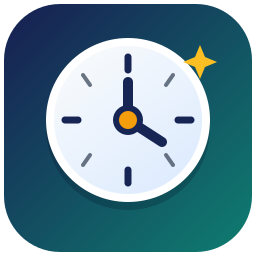

# Timeless Launcher

<p align="center">
  
</p>

Timeless Launcher is an independently branded, GPL-3.0-only fork of Prism Launcher for managing isolated Minecraft installations. It is not affiliated with or endorsed by Prism Launcher.

Project repository:
<https://github.com/c8dhjp4tyv-bit/timeless-launcher>

## Highlights

- Separate Minecraft instances with their own mods, worlds, resource packs and settings.
- Install and manage Fabric, Forge, Quilt and other supported loaders.
- Import and update modpacks from supported platforms.
- Java management, logs, themes, shortcuts and configurable launch options.

## Install

Once releases are published, downloads will be available from the project's
[Releases](https://github.com/c8dhjp4tyv-bit/timeless-launcher/releases) page. Development builds, if enabled by the maintainers, are published by the repository's GitHub Actions workflows and are intended for testing.

## Build from source

The project uses CMake, Qt 6 and Ninja. A typical local build is:

```sh
git clone https://github.com/c8dhjp4tyv-bit/timeless-launcher.git TimelessLauncher
cd TimelessLauncher
git submodule update --init --recursive
cmake -S . -B build -G Ninja -DCMAKE_BUILD_TYPE=Release
cmake --build build --parallel
```

The exact dependencies are platform-specific. The CMake configure step reports any missing packages. For Nix users, see [nix/README.md](nix/README.md).

## Service configuration

This fork does not ship credentials belonging to Prism Launcher. Microsoft authentication, CurseForge, Imgur, translation hosting, community links and the updater feed are disabled or configurable by default. Before enabling any integration, configure services and credentials owned by the Timeless Launcher maintainers and review their terms of use.

The legacy metadata and Forge-library endpoints remain configurable because existing Minecraft installations may depend on them. They are service endpoints, not Timeless Launcher branding.

## Forking and redistribution

You may fork, modify and redistribute this project under the terms of the GPL-3.0-only license. Derived distributions must preserve the applicable copyright and license notices, clearly identify their own branding, and avoid implying affiliation with Timeless Launcher, Prism Launcher, PolyMC or MultiMC.

## Licensing

- Launcher source code: [GPL-3.0-only](LICENSE).
- Upstream and third-party notices: [COPYING.md](COPYING.md) and [THIRD_PARTY_NOTICES.md](THIRD_PARTY_NOTICES.md).
- Timeless Launcher icon artwork: [CC BY 4.0](https://creativecommons.org/licenses/by/4.0/), with attribution recorded in the asset metadata and notices file.

Minecraft is a trademark of Microsoft. Timeless Launcher is not an official Minecraft product and is not endorsed by Microsoft.
